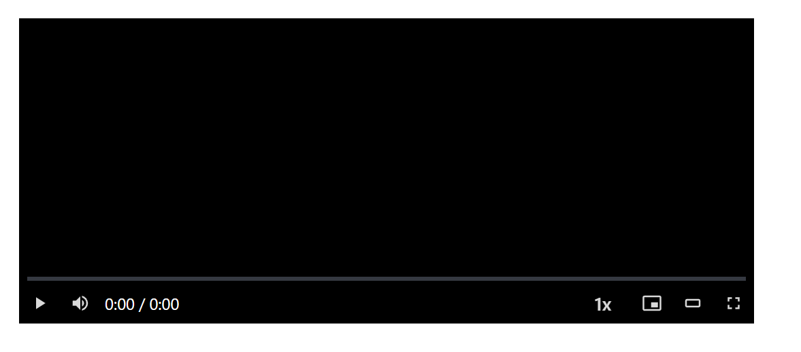

# React Video Player

A modern, responsive React video player component with customizable controls, thumbnail previews, and multiple viewing modes.



## Features

- 🎮 **Responsive Controls**: Play/pause, volume, timeline, fullscreen, and more
- 🎛️ **Playback Control**: Speed control, skip forward/backward
- 📱 **Multiple Viewing Modes**: Standard, theater, fullscreen, and picture-in-picture
- 👍 **Modern UI**: Clean, minimal interface with customizable styles
- 🖼️ **Video Thumbnails**: Preview thumbnails when hovering over the timeline
- ⌨️ **Keyboard Shortcuts**: Navigation and control via keyboard
- 🎯 **Timeline Scrubbing**: Intuitive timeline navigation
- 🔊 **Volume Controls**: Mute, volume slider with visual indicators
- 🔄 **Progress Tracking**: Visual display of video progress
- 📦 **TypeScript Support**: Full type definitions included
- 🪝 **Custom Hooks**: Access player state and controls in your application
- 🔌 **Callback Support**: Hooks for play, pause, end, and other events
- 🛠️ **React 18/19 Compatible**: Works with the latest React versions

## Installation

```bash
npm install react-video-player
# or
yarn add react-video-player
# or
pnpm add react-video-player
```

## Quick Start

```jsx
import React from 'react';
import { VideoPlayer } from 'react-video-player';
import 'react-video-player/style.css';

function App() {
  return (
    <div className="app">
      <VideoPlayer 
        src="https://example.com/video.mp4"
        onPlay={() => console.log('Video started playing')}
        onPause={() => console.log('Video paused')}
        onEnded={() => console.log('Video ended')}
      />
    </div>
  );
}

export default App;
```

## Props

The `VideoPlayer` component accepts the following props:

| Prop | Type | Default | Description |
|------|------|---------|-------------|
| `src` | `string` | *Required* | URL of the video source |
| `paused` | `boolean` | `true` | Initial paused state of the video |
| `speed` | `number` | `1` | Initial playback speed |
| `onPlay` | `() => void` | `undefined` | Callback triggered when video starts playing |
| `onPause` | `() => void` | `undefined` | Callback triggered when video is paused |
| `onEnded` | `() => void` | `undefined` | Callback triggered when video ends |
| `onTimeUpdate` | `(currentTime: number, duration: number) => void` | `undefined` | Callback triggered on time update |
| `onVolumeChange` | `(volume: number, muted: boolean) => void` | `undefined` | Callback triggered when volume changes |
| `className` | `string` | `''` | Additional CSS class to apply to the container |
| `children` | `ReactNode` | `undefined` | Children elements to render inside the player |

## Hooks

The library exports several hooks that allow you to control the video player programmatically:

### useVideoState

Access the video player's state:

```jsx
import { useVideoStateContext } from 'react-video-player';

function VideoInfo() {
  const { isPaused, currentTime, totalTime, playbackSpeed } = useVideoStateContext();
  
  return (
    <div>
      <p>Status: {isPaused ? 'Paused' : 'Playing'}</p>
      <p>Current time: {currentTime}</p>
      <p>Total time: {totalTime}</p>
      <p>Playback speed: {playbackSpeed}</p>
    </div>
  );
}
```

### useVideoControls

Control the video player programmatically:

```jsx
import { useVideoControlsContext } from 'react-video-player';

function CustomControls() {
  const { togglePlay, toggleMute, skip, changePlaybackSpeed } = useVideoControlsContext();
  
  return (
    <div className="custom-controls">
      <button onClick={togglePlay}>Play/Pause</button>
      <button onClick={toggleMute}>Mute/Unmute</button>
      <button onClick={() => skip(-10)}>Rewind 10s</button>
      <button onClick={() => skip(10)}>Forward 10s</button>
      <button onClick={changePlaybackSpeed}>Change Speed</button>
    </div>
  );
}
```

### Other Hooks

- `useTimeUpdate`: Access time update functionality
- `useVideoEventsContext`: Access video event handlers
- `useScrubbing`: Access timeline scrubbing functionality

## Keyboard Shortcuts

The player supports the following keyboard shortcuts:

| Key | Action |
|-----|--------|
| `Space` or `K` | Play/Pause |
| `M` | Mute/Unmute |
| `F` | Toggle Fullscreen |
| `T` | Toggle Theater Mode |
| `I` | Toggle Picture-in-Picture |
| `Arrow Left` or `J` | Rewind 5 seconds |
| `Arrow Right` or `L` | Forward 5 seconds |

## Player Modes

### Theater Mode

Theater mode expands the video to take up more screen width while maintaining its position in the page:

```jsx
<VideoPlayer src="https://example.com/video.mp4" />
// User can toggle theater mode with the theater button or 'T' key
```

### Fullscreen Mode

Fullscreen mode expands the video to cover the entire screen:

```jsx
<VideoPlayer src="https://example.com/video.mp4" />
// User can toggle fullscreen mode with the fullscreen button or 'F' key
```

### Picture-in-Picture Mode

Picture-in-Picture mode allows the video to be played in a small floating window:

```jsx
<VideoPlayer src="https://example.com/video.mp4" />
// User can toggle PiP mode with the mini-player button or 'I' key
```

## Customization

### Styling

The component comes with a default styling that you can customize by overriding CSS variables or classes:

```css
/* Override the primary color */
.ps-video-container {
  --primary-color: #ff0000;
}

/* Customize the timeline */
.ps-timeline::after {
  background-color: var(--primary-color);
}
```

## Advanced Usage

### Using with External Controls

```jsx
import React from 'react';
import { VideoPlayer, useVideoControls } from 'react-video-player';

function App() {
  return (
    <div className="app">
      <VideoPlayer src="https://example.com/video.mp4" />
      <ExternalControls />
    </div>
  );
}

function ExternalControls() {
  const { togglePlay, skip, toggleMute } = useVideoControls();
  
  return (
    <div className="external-controls">
      <button onClick={togglePlay}>Play/Pause</button>
      <button onClick={() => skip(-30)}>Rewind 30s</button>
      <button onClick={() => skip(30)}>Forward 30s</button>
      <button onClick={toggleMute}>Mute/Unmute</button>
    </div>
  );
}

export default App;
```

### Using with Multiple Players

```jsx
import React from 'react';
import { VideoPlayer, VideoProvider } from 'react-video-player';

function MultiplePlayersApp() {
  return (
    <div className="multi-player-app">
      {/* Each VideoPlayer creates its own context */}
      <VideoPlayer src="https://example.com/video1.mp4" />
      <VideoPlayer src="https://example.com/video2.mp4" />
    </div>
  );
}

export default MultiplePlayersApp;
```

## Browser Support

React Video Player works in all modern browsers that support HTML5 video:

- Chrome (latest)
- Firefox (latest)
- Safari (latest)
- Edge (latest)

## Contributing

Contributions are welcome! Please feel free to submit a Pull Request.

## License

[MIT](LICENSE) © Ziya Akhundov
